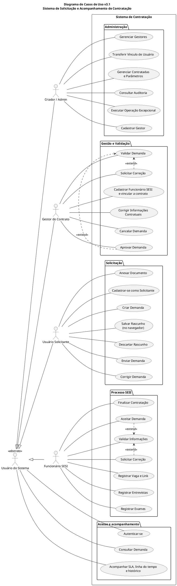
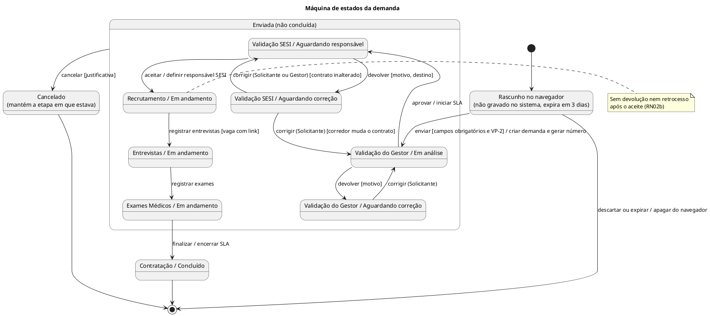
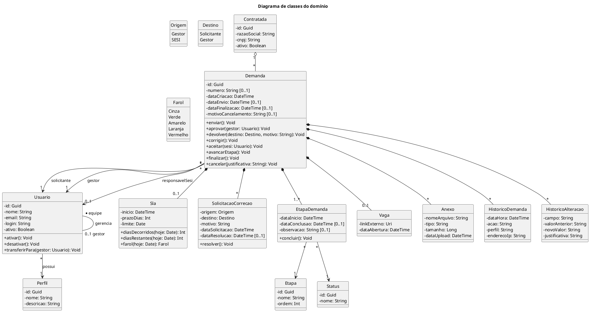
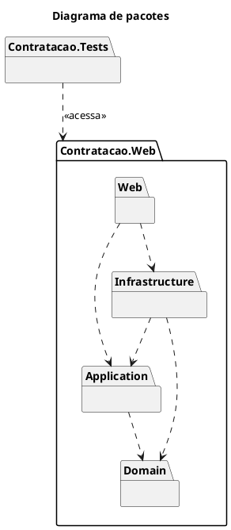
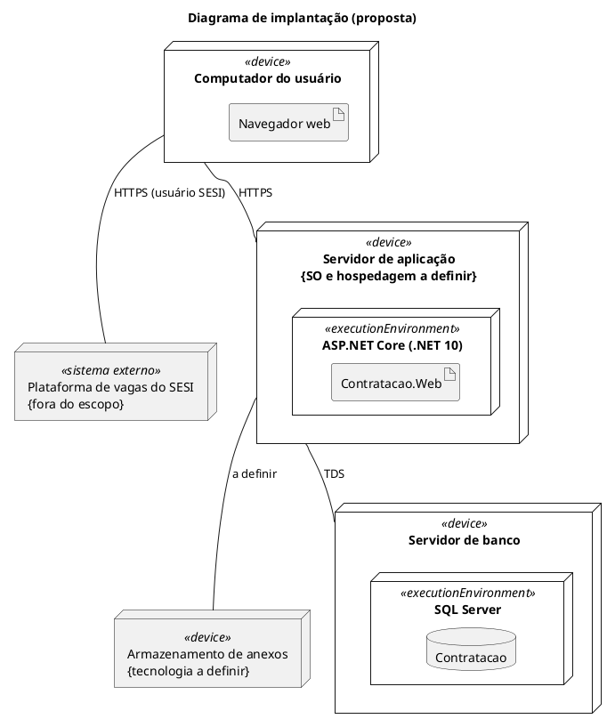

# Requisitos e Casos de Uso v3.1 — Sistema de Contratação

Oct 5, 2026 · @Renan

## Controle de versão

A v3.1 substitui a v3.0 (setembro de 2026) e resolve as inconsistências encontradas na análise. O documento de classes, pacotes e modelos de dados continua sendo proposta de projeto; onde ele diverge desta versão, prevalece esta.

Cada mudança tem uma origem. **Cliente** = decidido pelo responsável do processo. **Recomendação** = proposta técnica adotada por instrução do cliente, a confirmar com quem é dono do processo. Itens ainda abertos estão na última seção.

| # | Tema | v3.0 | v3.1 | Origem |
| --- | --- | --- | --- | --- |
| 1 | Visibilidade das demandas pelo Gestor | Só as do próprio escopo | Todos os Gestores veem todas as demandas | Cliente |
| 2 | Número da demanda | Não definido | AAAA-NNNNNN, ex.: 2026-000123 | Cliente |
| 3 | Diagramas | Notação livre | Notação UML: casos de uso, máquina de estados, classes, pacotes e implantação | Cliente |
| 4 | Etapas e status | Listas divergentes nas seções 5, 15, 24 e 32 | Modelo único: 7 etapas, 7 status e eventos separados | Recomendação |
| 5 | Cancelado x Cancelada | As duas formas | Cancelado | Recomendação |
| 6 | Retorno após correção pedida pelo SESI | Não definido | Volta direto à Validação SESI | Recomendação |
| 7 | Correção pelo Gestor | Sem caso de uso no diagrama | Novo UC16 Corrigir Informações Contratuais | Recomendação |
| 8 | Rascunho | Cancelado pelo Usuário | Descartado pelo Usuário, com exclusão física | Recomendação |
| 9 | Quem cancela | Gestor autorizado (indefinido) | Qualquer Gestor ativo; Admin por operação excepcional (UC20) | Recomendação |
| 10 | Visibilidade do SESI | Vínculo ao Gestor x filtro por Gestor | SESI vê todas as demandas | Recomendação |
| 11 | Permissões por campo | Não sem distinguir ver de editar | Não = não edita; visualização segue o UC15 | Recomendação |
| 12 | SLA | Corridos ou úteis em aberto; vencimento indefinido | 45 dias corridos, vence ao fim do dia limite, horário de Brasília | Recomendação |
| 13 | Prazo do SLA parametrizável | Não definido | Admin altera; vale só para demandas novas | Recomendação |
| 14 | Retrocesso após o aceite | Não definido | Não permitido no MVP; só por operação administrativa | Recomendação |
| 15 | Responsável SESI | Não definido | Quem aceita a demanda | Recomendação |
| 16 | Auditoria | Perfil e IP exigidos, ausentes no modelo | Perfil, IP, justificativa e log geral de auditoria | Recomendação |
| 17 | Anexo | Etapa exigida, ausente no modelo | Anexo registra a etapa | Recomendação |
| 18 | Operações administrativas | Citadas sem caso de uso | Novo UC20 Executar Operação Excepcional | Recomendação |
| 19 | Notificações | Recomendadas | Fora do MVP; eventos já emitidos | Recomendação |
| 20 | Estrutura do código | 6 projetos | Projeto único com tipos internal | Recomendação |

### Revisão de 05/10/2026 (Cliente)

Decisões tomadas pelo cliente depois da análise da v3.1. Elas prevalecem sobre o restante do documento, que já foi ajustado a elas.

| # | Tema | Antes | Agora | Origem |
| --- | --- | --- | --- | --- |
| 21 | Cadastro do Solicitante | O Gestor cadastra (UC13) | O Solicitante se cadastra sozinho, com e-mail @ucl.br (UC13 revisto) | Cliente |
| 22 | Visibilidade do SESI | Todas as demandas | Cada contrato tem um grupo de Funcionários SESI; o Gestor vincula cada funcionário a um contrato, e ele vê e trata só as demandas desse contrato | Cliente |
| 23 | Rascunho | Gravado no banco, com descarte físico | Existe só no navegador do Solicitante e dura 3 dias; a demanda só passa a existir no sistema no envio | Cliente |
| 24 | Gestor da demanda | Não definido (Demanda.GestorId obrigatório) | É o Gestor que valida a demanda; fica vazio até a validação | Cliente |
| 25 | Contratada da demanda | Pendente (D6) | Definida pelo contrato; hoje a única Contratada é o SESI | Cliente |
| 26 | Corredor trocado na correção pedida pelo SESI | Voltava direto ao SESI | Se a troca mudar o contrato, a demanda volta à Validação do Gestor | Cliente |
| 27 | Custo após correção | Não definido | Qualquer alteração nos campos do QQP recalcula o custo | Cliente |
| 28 | Quem trata a demanda entre os Gestores | Qualquer Gestor ativo valida, devolve e cancela (S1) | Todo Gestor continua vendo todas as demandas, mas só os Gestores vinculados ao contrato da demanda a validam, devolvem e cancelam; um Gestor pode ter vários contratos | Cliente |
| 29 | Desativar Solicitante | Gestor da equipe | O Admin e qualquer Gestor ativo desativam e reativam Solicitantes | Cliente |
| 30 | CNPJ da Contratada | Obrigatório | Opcional | Cliente |
| 31 | Anexos e prazo do rascunho | — | Anexos escolhidos no envio, fora do rascunho; os 3 dias contam do último salvamento | Cliente |

## 1–3. Objetivo e escopo

O sistema digitaliza, centraliza e controla a solicitação e a contratação de funcionários de empresas contratadas, da solicitação inicial até a contratação finalizada, com histórico completo. Sem mudanças de objetivo em relação à v3.0.

**Objetivos específicos:** centralizar e padronizar as solicitações, reduzir controles manuais, acompanhar em tempo real, controlar o SLA de 45 dias, identificar demandas próximas do vencimento, registrar responsáveis e datas de cada etapa, permitir correções, manter histórico e auditoria, registrar o link da vaga externa e impedir alterações indevidas em registros históricos.

**Dentro do escopo (MVP):** autenticação; usuários, perfis e hierarquia de cadastro; demandas com rascunho no navegador, envio e numeração; validação do Gestor; devolução e correção; validação e aceite do SESI; registro da vaga e do link externo; entrevistas; exames médicos; finalização; SLA e farol; dashboards; linha do tempo; histórico e auditoria; anexos; descarte de rascunho e cancelamento controlado.

**Fora do escopo:**

- Executar o recrutamento na plataforma externa do SESI. O sistema apenas registra e acompanha o que acontece lá.
- Notificações automáticas: ficam para uma fase posterior ao MVP (seção 29).
- Indicadores gerenciais: fase posterior, como já previa a v3.0 (seção 30).

## 4. Atores, hierarquia e visibilidade

A hierarquia de cadastro da v3.0 se mantém. A mudança é que o vínculo com o Gestor passa a definir **quem gerencia o cadastro** do usuário, e não mais quem enxerga as demandas.

| Ator | Responsabilidade | Demandas que visualiza |
| --- | --- | --- |
| Criador/Admin | Cadastra e gerencia Gestores, contratadas e parâmetros; consulta auditoria completa; executa operações excepcionais auditadas | Todas |
| Gestor do Contrato | Cadastra e gerencia sua equipe SESI; valida, devolve, corrige informações contratuais e cancela as demandas dos seus contratos | Todas (Cliente); trata só as dos seus contratos (Cliente) |
| Usuário Solicitante | Cadastra-se sozinho; cria, envia, corrige e acompanha demandas; anexa documentos; descarta rascunhos | Apenas as que criou |
| Funcionário SESI | Valida, aceita ou devolve; registra vaga, entrevistas e exames; finaliza a contratação | As do contrato a que está vinculado (Cliente) |

### 4.5 Regras de cadastro e vínculo

1. O Admin cadastra e gerencia os Gestores e os vincula aos contratos por que respondem. É o único perfil que faz isso. Um Gestor pode ter vários contratos, e um contrato pode ter vários Gestores (Cliente).
2. O Usuário Solicitante se cadastra sozinho (UC13), com um e-mail @ucl.br. Qualquer pessoa com e-mail do domínio pode se cadastrar; o perfil Solicitante é atribuído automaticamente (Cliente). O Solicitante não tem Gestor responsável (GestorResponsavelId nulo); o Admin e qualquer Gestor ativo podem desativá-lo e reativá-lo (Cliente).
3. Cada Gestor cadastra e gerencia os Funcionários SESI da sua equipe e vincula cada um a um contrato (UC14). Esses usuários ficam vinculados ao Gestor que os cadastrou (GestorResponsavelId).
4. Um Gestor não edita, desativa nem reativa usuários de outro Gestor.
5. Todo Gestor ativo visualiza todas as demandas, de qualquer Solicitante. A demanda chega aos Gestores do seu contrato (definido pelo corredor, RN13), e só eles a validam, devolvem e cancelam (Cliente). **SUPOSIÇÃO — confirmar (S1):** corrigir as informações contratuais (UC16) também é restrito aos Gestores do contrato.
6. Usuários nunca são excluídos, apenas desativados.
7. Gestor desativado: as demandas dos seus contratos continuam com os demais Gestores desses contratos. Se um contrato ficar sem Gestor ativo, suas demandas aguardam até o Admin vincular um Gestor a ele. **SUPOSIÇÃO — confirmar:** a equipe do Gestor desativado continua ativa e o Admin pode transferir o vínculo dela para outro Gestor (UC19).
8. Cada contrato tem um grupo de Funcionários SESI, e cada funcionário pertence ao grupo de um contrato. Ele vê e trata só as demandas desse contrato (Cliente). O contrato da demanda vem do corredor (RN13). **SUPOSIÇÃO — confirmar (S17):** "tratar" inclui aceitar, devolver, registrar vaga, entrevistas e exames e finalizar.

**RN11 — Autenticação (Cliente).** Todo usuário, de qualquer perfil, entra com um e-mail do domínio @ucl.br e uma senha própria do sistema. O sistema recusa cadastro e login com qualquer outro domínio e guarda só o hash da senha. O Solicitante faz o próprio cadastro; os demais perfis são cadastrados pelo Admin (Gestor) ou pelo Gestor (Funcionário SESI). O domínio imita o Google Workspace da UCL, mas, por ser um sistema de teste, não há conexão real com o Workspace.

## 5. Etapas, status e eventos

O sistema tem 7 etapas e 6 status (o rascunho existe só no navegador e não é status gravado; ver UC02). Marcos como aprovação, aceite e vaga aberta são **eventos**: aparecem na linha do tempo, mas não são etapas nem status. Isso substitui as listas divergentes das seções 5, 15, 24 e 32 da v3.0.

### 5.1 Etapas

| Ordem | Etapa | O que acontece |
| --- | --- | --- |
| 1 | Solicitação | Preenchimento, com rascunho guardado só no navegador, até o envio |
| 2 | Validação do Gestor | Análise, aprovação ou devolução ao Solicitante |
| 3 | Validação SESI | Análise, aceite ou devolução ao Solicitante ou ao Gestor |
| 4 | Recrutamento | Abertura da vaga na plataforma externa e registro do link |
| 5 | Entrevistas | Entrevistas em andamento |
| 6 | Exames Médicos | Exames em andamento |
| 7 | Contratação | Contratação finalizada |

### 5.2 Status da demanda

| Status | Significado | Etapas em que ocorre |
| --- | --- | --- |
| Em análise | Aguardando decisão do Gestor | Validação do Gestor |
| Aguardando correção | Devolvida; aguarda quem deve corrigir | Validação do Gestor, Validação SESI |
| Aguardando responsável | Aprovada pelo Gestor; aguarda aceite do SESI | Validação SESI |
| Em andamento | Processo SESI em execução | Recrutamento, Entrevistas, Exames Médicos |
| Concluído | Contratação finalizada | Contratação |
| Cancelado | Processo interrompido | Qualquer etapa após o envio, exceto Contratação |

Os registros de EtapaDemanda usam os mesmos status para cada passagem: a etapa anterior fica Concluído quando a demanda avança. A etapa Solicitação é registrada no envio, já concluída.

### 5.3 Eventos da linha do tempo

Enviada (a demanda passa a existir no sistema) · Aprovada pelo Gestor (início do SLA) · Devolvida para correção · Correção enviada · Aceita pelo SESI · Vaga aberta · Entrevistas iniciadas · Exames iniciados · Contratação finalizada · Cancelada.

Exemplos com a nova nomenclatura: uma demanda recém-aprovada fica em **Validação SESI / Aguardando responsável** (antes chamado "Aguardando SESI"). Uma demanda com vaga já aberta fica em **Recrutamento / Em andamento**, e a abertura da vaga aparece como evento (antes, o status "Vaga aberta").

## 6–7. Fluxo geral e devoluções

A demanda só avança: devoluções acontecem apenas nas duas etapas de validação, e depois do aceite do SESI não há retorno. O diagrama abaixo mostra o caminho completo.

> Diagrama de máquina de estados: código PlantUML no Apêndice A.1.

Diagrama de máquina de estados (UML): ● é o estado inicial, ◉ os estados finais, e o estado composto "Enviada" agrupa tudo o que pode ser cancelado. As duas devoluções voltam para a mesma etapa de validação.

**RN01 — Devolução pelo Gestor.** Na Validação do Gestor, o Gestor pode devolver a demanda ao Solicitante, com motivo obrigatório. Após a correção, ela volta à Validação do Gestor / Em análise.

**RN02 — Devolução pelo SESI.** Na Validação SESI, o SESI pode devolver com motivo obrigatório, indicando o destino:

- inconsistência nas informações do solicitante → Solicitante;
- inconsistência nas informações contratuais → Gestor.

**RN02a — Retorno após correção do SESI (Recomendação).** Corrigida pelo destinatário, a demanda volta direto à Validação SESI / Aguardando responsável, sem nova aprovação do Gestor. **Exceção (Cliente):** se o Solicitante trocar o corredor e com isso mudar o contrato (RN13), a demanda volta à Validação do Gestor / Em análise, porque o contrato é informação contratual já validada pelo Gestor.

**RN02b — Sem retrocesso após o aceite (Recomendação).** A partir de Recrutamento, não há devolução nem volta de etapa. Qualquer exceção é operação administrativa do Admin, com justificativa e auditoria. **Confirmar:** com que frequência um candidato é reprovado nos exames e o processo precisa voltar ao recrutamento. Se for comum, o retrocesso deve ser modelado.

**RN02c — Registro das devoluções.** Toda devolução gera uma SolicitacaoCorrecao com origem, destino, motivo, data da solicitação e data da resolução. O SLA continua contando durante a correção (RN05).

## 8. Casos de uso

São 20 casos de uso: os 15 da v3.0, com ajustes, e 5 novos (UC16 a UC20). Os fluxos da v3.0 valem onde não houver mudança indicada.

| ID | Caso de uso | Ator | Mudança na v3.1 |
| --- | --- | --- | --- |
| UC01 | Autenticar Usuário | Todos | Nenhuma |
| UC02 | Criar Demanda | Solicitante | Rascunho só no navegador; a demanda é criada no sistema no envio, com número AAAA-NNNNNN |
| UC03 | Consultar Demanda | Todos | Escopo conforme seção 4 |
| UC04 | Validar Demanda | Gestor | Gestor ativo vinculado ao contrato da demanda (Cliente); aprovação leva a Validação SESI / Aguardando responsável |
| UC05 | Solicitar Correção | Gestor, SESI | SESI informa o destino; gera SolicitacaoCorrecao |
| UC06 | Corrigir Demanda | Solicitante | Só o Solicitante; o Gestor passa a usar o UC16 |
| UC07 | Aceitar Demanda | SESI | Quem aceita vira o responsável SESI |
| UC08 | Registrar Vaga | SESI | Link obrigatório; registrado como evento em Recrutamento |
| UC09 | Registrar Entrevistas | SESI | Exige vaga com link registrada |
| UC10 | Registrar Exames Médicos | SESI | Exige etapa Entrevistas |
| UC11 | Finalizar Contratação | SESI | Exige etapa Exames Médicos |
| UC12 | Cadastrar Gestor | Admin | Vincula o Gestor a um ou mais contratos (Cliente) |
| UC13 | Cadastrar-se como Solicitante | Solicitante | Autocadastro com e-mail @ucl.br (Cliente); antes o Gestor cadastrava |
| UC14 | Cadastrar Funcionário SESI | Gestor | Vincula o funcionário a um contrato (Cliente) |
| UC15 | Acompanhar Demanda | Todos | Escopo conforme seção 4 |
| UC16 | Corrigir Informações Contratuais | Gestor | Novo |
| UC17 | Descartar Rascunho | Solicitante | Novo; o rascunho é apagado do navegador (Cliente) |
| UC18 | Cancelar Demanda | Gestor | Novo (a v3.0 citava, sem caso de uso) |
| UC19 | Transferir Vínculo de Usuário | Admin | Novo (SUPOSIÇÃO — confirmar) |
| UC20 | Executar Operação Excepcional | Admin | Novo (a v3.0 citava na seção 4.1, sem caso de uso) |

### UC02 — Numeração

No envio, o sistema gera o número no formato AAAA-NNNNNN: o ano do envio e um sequencial de 6 dígitos (ex.: 2026-000123). **SUPOSIÇÃO — confirmar:** o sequencial reinicia a cada ano. Rascunhos não chegam ao sistema e por isso não têm número.

### UC02 — Rascunho no navegador (Cliente)

1. Enquanto o Solicitante preenche o formulário, os dados escolhidos são guardados só no navegador dele, para que ele possa parar e continuar depois.
2. O rascunho dura 3 dias, contados a partir do último salvamento; depois disso, o navegador o descarta (Cliente).
3. O servidor não recebe nem guarda rascunhos: a demanda passa a existir no sistema no envio, que registra a criação, o número, o contrato, o custo e a etapa Solicitação já concluída. DataCriacao é a data do envio.
4. Rascunhos não aparecem para Gestores, SESI nem Admin, e não estão disponíveis em outro navegador ou computador.
5. Os arquivos anexados não ficam no rascunho do navegador; o Solicitante os escolhe no envio, inclusive o De acordo VP-2 (Cliente).

### UC13 — Cadastrar-se como Solicitante (Cliente)

1. A pessoa informa nome, e-mail @ucl.br e senha.
2. O sistema recusa e-mail de outro domínio ou já cadastrado (RN11).
3. O sistema cria o usuário ativo com perfil Solicitante, guarda só o hash da senha e registra o cadastro no log de auditoria.

### UC14 — Cadastrar Funcionário SESI (alterado)

O Gestor cadastra o Funcionário SESI na sua equipe e escolhe o contrato a que ele fica vinculado. A troca de contrato é registrada no log de auditoria com valor anterior e novo.

### UC16 — Corrigir Informações Contratuais

1. A demanda está em Validação SESI / Aguardando correção, com destino Gestor.
2. O Gestor vê o motivo da devolução.
3. Edita apenas as informações contratuais.
4. O sistema registra valores anteriores e novos, usuário e data/hora.
5. A demanda volta a Validação SESI / Aguardando responsável.

### UC17 — Descartar Rascunho

1. O Solicitante escolhe descartar o rascunho guardado no navegador.
2. O sistema pede confirmação.
3. O rascunho é apagado do navegador. Como o servidor nunca recebeu o rascunho, não há exclusão no banco nem registro de auditoria.

### UC18 — Cancelar Demanda

1. Gestor ativo vinculado ao contrato da demanda, ou o Admin, escolhe cancelar uma demanda enviada e não finalizada.
2. Informa a justificativa, obrigatória.
3. A demanda fica Cancelado na etapa em que estava; o SLA é encerrado.
4. O sistema registra histórico e auditoria. Nada é excluído.

### UC19 — Transferir Vínculo de Usuário

1. O Admin escolhe Funcionários SESI de um Gestor (Solicitantes não têm Gestor responsável; ver 4.5).
2. Escolhe o Gestor de destino e informa a justificativa.
3. O sistema altera GestorResponsavelId e registra valor anterior e novo no log de auditoria.

### UC20 — Executar Operação Excepcional

1. O Admin escolhe a operação: cancelar demanda, alterar data congelada ou forçar uma transição fora da sequência.
2. Informa a justificativa, obrigatória.
3. O sistema executa e registra valor anterior, novo valor, usuário, perfil, IP e justificativa no log de auditoria.

## 8.1 Formulário e custo da demanda

O formulário da demanda reproduz as colunas da lista tb\_demandas\_cadastradas do aplicativo atual (154 registros analisados), organizadas em sete grupos; o cargo é escolhido por listas em cascata no catálogo QQP, e o sistema calcula o custo total. Campos de fluxo do aplicativo antigo (datas de validação, recusa, recebimento) não entram no formulário: viram eventos do fluxo, conforme a tabela de correspondência no fim desta seção.

### Campos

Obrigatório = campo preenchido em todos os registros analisados (**SUPOSIÇÃO S12 — confirmar**). Campos "condicionais" só aparecem e só são exigidos quando o campo anterior é marcado.

| Grupo | Campo | Tipo | Obrigatório | Lista ou regra |
| --- | --- | --- | --- | --- |
| Identificação | Solicitante | Usuário logado | Sim | Preenchido pelo sistema |
| Identificação | Área do solicitante | Texto | Não | Livre |
| Identificação | Tipo de demanda | Lista | Sim | TipoDemanda: por enquanto só Nova contratação |
| Identificação | Gerente executivo | Lista | Sim | GerenteExecutivo: gerente responsável pela área |
| Vaga | Localidade da vaga | Texto | Sim | Livre |
| Vaga | Corredor | Lista | Sim | Corredor: 7 combinações de corredor e região (RN13) |
| Vaga | Modelo de trabalho | Lista | Sim | Presencial, Híbrido ou Remoto |
| Vaga | Quantidade de vagas | Inteiro | Sim | Maior que zero |
| Vaga | Descrição das atividades | Texto longo | Sim | Livre |
| Vaga | Formação exigida | Texto | Não | Livre |
| Vaga | Temporária | Sim/não | Sim | — |
| Vaga | Período temporário | Inteiro, em dias (**S13**) | Condicional | Exigido quando Temporária = sim |
| Cargo e preço | Região, função, classificação, nível, carga horária | Listas em cascata | Sim | Catálogo QQP (seção 23); a combinação define o item |
| Cargo e preço | Piso salarial e preço unitário | Somente leitura | — | Mostrados ao escolher o item |
| Recursos | Notebook, segunda tela, celular | Sim/não cada | Sim | Entram no custo (RN12) |
| Recursos | Veículo | Sim/não | Sim | — |
| Recursos | Tipo de veículo | Lista | Condicional | Veiculo (ex.: Veículo 4x4); exigido quando Veículo = sim |
| Recursos | Rastreador | Sim/não | Condicional | Só disponível com veículo |
| Recursos | Exige CNH | Sim/não | Sim | — |
| Recursos | Categoria da CNH | Lista | Condicional | A, B, C, D, E, AB, AC, AD, AE; exigida quando Exige CNH = sim |
| Segurança | RACs | Múltipla escolha | Não | Rac: RAC 01 a RAC 13, da lista tb\_racs (ex.: RAC 01 Trabalhos em altura) |
| Contrato | Número do contrato | Automático | Sim | Definido pelo corredor (RN13); somente leitura |
| Contrato | OS do contrato | Lista ou texto | Sim | Ex.: 01, 15, 31 |
| Contrato | Coletor de custo | Texto | Sim | Livre |
| Contrato | Responsável efetivo: nome e e-mail | Texto | Sim | E-mail válido, sem restrição de domínio (é um contato, não um usuário) |
| Contrato | Fiscal efetivo: nome e e-mail | Texto | Sim | Idem |
| Outros | Observações | Texto longo | Não | Livre |
| Outros | De acordo VP-2 | Anexo | Sim | Anexo de categoria própria; sem ele a demanda não pode ser enviada (Cliente) |

**Informações contratuais (SUPOSIÇÃO S11 — confirmar):** OS e coletor de custo; o número do contrato vem do corredor (RN13). O Solicitante preenche os demais campos ao criar a demanda; o Gestor também pode editar as informações contratuais durante a validação e quando o SESI devolve para ele (UC16).

**Listas em cascata.** Cada lista de cargo só mostra opções compatíveis com as escolhas anteriores. Escolhidos os cinco valores, o sistema mostra piso e preço do item. Se a combinação tiver mais de um item (caso dos códigos 466 e 467), o Solicitante escolhe pelo código.

### RN13 — Contrato definido pelo corredor (Cliente)

O contrato da demanda é escolhido pelo sistema a partir do corredor, independentemente do item QQP: corredores da região Norte caem num contrato e os da região Sudeste, no outro. O Solicitante não escolhe o contrato.

| Corredor | Região | Contrato |
| --- | --- | --- |
| Norte | Norte | 5900125082 |
| Pelotização | Norte | 5900125082 |
| C. Integrado | Norte | 5900125082 |
| Sudeste | Sudeste | 5900118506 |
| Sul | Sudeste | 5900118506 |
| Pelotização | Sudeste | 5900118506 |
| C. Integrado | Sudeste | 5900118506 (**S16 — confirmar**) |

Os números de contrato foram deduzidos do aplicativo atual: 150 das 154 demandas já seguem essa divisão, e as 4 restantes (3 com contrato trocado e 1 sem corredor) são justamente os erros que a regra evita. O cliente citou Sudeste, Sul e Pelotização no segundo contrato; C. Integrado Sudeste entra nele porque as 9 demandas desse corredor estão nesse contrato.

A demanda guarda o contrato vigente no envio. Se o corredor for trocado numa correção, o contrato é recalculado; se ele mudar numa correção pedida pelo SESI, a demanda volta ao Gestor (RN02a). O Admin altera a ligação entre corredor e contrato pela tela de parâmetros.

**Contratada (Cliente).** Cada contrato pertence a uma Contratada, e a Contratada da demanda é a do seu contrato: o sistema a define junto com o contrato, sem escolha do Solicitante. Hoje a única Contratada é o SESI.

**RACs.** A antiga lista tb\_demanda\_racs vira uma tabela de ligação DemandaRac (uma linha por RAC marcada). Assim a edição é direta e cada mudança fica no histórico.

### RN12 — Custo total

O custo total é calculado pelo sistema e gravado na demanda com os valores vigentes no envio; mudanças posteriores de preço não alteram demandas já enviadas. Se uma correção alterar qualquer campo do QQP (região, função, classificação, nível ou carga horária), o custo é recalculado (Cliente) e a alteração fica no HistoricoAlteracao.

```latex
\text{Custo total} = \text{Quantidade} \times (\text{Preço unitário QQP} + \text{Equipamentos por pessoa}) + \text{Veículo} + \text{Rastreador}
```

Os valores abaixo foram deduzidos dos 154 registros: a fórmula reproduz o custo total de 153 deles, com diferença de centavos. Ficam numa tabela de catálogo, editável pelo Admin.

| Item | Valor deduzido | Cobrança |
| --- | --- | --- |
| Notebook | `R$ 444,35` | Por pessoa |
| Segunda tela | `R$ 53,93` | Por pessoa |
| Celular | `R$ 118,64` | Por pessoa |
| Veículo 4x4 | `R$ 9.113,47` | Uma vez por demanda (**S14**) |
| Rastreador | `R$ 345,13` | Uma vez por demanda (**S14**) |

**Confirmar (S15):** esses valores, se o custo é mensal e se veículo e rastreador são mesmo cobrados uma vez por demanda. Numa demanda de 3 vagas que pedia 2 veículos, o custo registrado inclui um único veículo. Valores de veículo informados pelo cliente (lista Tb\_veiculos): Veículo 4x4 \`R$ 9.113,47\`, Veículo de passeio \`R$ 5.292,29\`, Veículo van \`R$ 18.874,06\` e Transporte \`R$ 539,26\`.

### Correspondência com o aplicativo atual

| Coluna antiga | Onde fica na v3.1 |
| --- | --- |
| nome\_solicitante, email\_solicitante | Usuário logado (Demanda.UsuarioSolicitanteId) |
| email\_gestor, gestor\_contrato | Demanda.GestorId (o Gestor que valida a demanda) |
| Criado, data\_criacao | Demanda.DataCriacao |
| data\_validacao\_gestor | Evento "Aprovada pelo Gestor" e início do SLA |
| data\_rejeicao\_gestor, motivo\_da\_recusa | Uma SolicitacaoCorrecao por devolução, origem Gestor |
| necessita\_edicao | Status Aguardando correção |
| data\_recebimento\_sesi, responsavel\_sesi | Evento "Aceita pelo SESI" e Demanda.ResponsavelSesiId |
| rejeicao\_sesi, motivo\_rejeicao\_sesi, data\_rejeicao\_sesi | Uma SolicitacaoCorrecao por devolução, origem SESI |
| data\_conclusao\_demanda | Demanda.DataFinalizacao |
| deAcordoVP2 | Anexo de categoria DeAcordoVP2 |
| rac´s, tb\_demanda\_racs | Tabela DemandaRac |
| ID, id\_espelho | Substituídos pelo número AAAA-NNNNNN |
| tipo\_demanda: tipo\_demandas | Coluna duplicada; só TipoDemanda |

No aplicativo atual, o motivo de cada recusa é acrescentado ao mesmo campo de texto, com a data na frente. Na v3.1, cada devolução é um registro próprio.

**Dados pessoais.** A planilha tb\_demandas\_cadastradas contém nomes e e-mails reais. Ela serviu só para definir a estrutura e **não vai para o repositório** nem para a seed. Importar demandas antigas não faz parte do escopo, salvo pedido do cliente.

## 9–11. SLA e farol

O SLA conta 45 dias corridos a partir da aprovação do Gestor, nunca reinicia nem pausa, e vence ao fim do dia limite no horário de Brasília. As regras RN03 e RN05 da v3.0 se mantêm; RN04 e o farol foram completados.

**RN03 — Início.** DataInicioSLA = data e hora da aprovação do Gestor.

**RN04 — Prazo (Recomendação — confirmar).** Dias corridos, como no exemplo da própria v3.0 (01/09 + 45 = 16/10). DataLimiteSLA = data da aprovação, no horário de Brasília, + PrazoDiasSla. A demanda vence às 23:59:59 do dia limite.

**RN05 — Sem reinício e sem pausa.** Devoluções e correções não alteram o início nem o limite.

**RN07 — Prazo parametrizável (Recomendação).** O Admin pode alterar o prazo padrão (45). Cada demanda grava o prazo vigente quando o SLA começa; a alteração vale só para demandas aprovadas depois dela.

**RN08 — Cálculo.** Datas gravadas em UTC; contagem feita sobre as datas no fuso America/Sao\_Paulo.

- Dias decorridos = hoje − data de início
- Dias restantes = data limite − hoje

No exemplo da v3.0, em 16/09 temos 15 dias decorridos e 30 restantes, o que continua válido.

### Farol

| Situação | Farol |
| --- | --- |
| SLA não iniciado | Cinza |
| Mais de 10 dias restantes | Verde |
| 6 a 10 dias restantes | Amarelo |
| 0 a 5 dias restantes (0 = vence hoje) | Laranja |
| Prazo vencido (restantes negativos) | Vermelho |
| Finalizada até o dia limite | Verde |
| Finalizada após o dia limite | Vermelho |
| Cancelada | Cinza, com o rótulo Cancelado |

O dia limite (0 restantes) era uma lacuna na v3.0, que ia de "1 a 5" direto para "vencido"; na v3.1 ele fica laranja. A linha de demanda cancelada também é nova. **Confirmar** as duas.

## 12–15. Linha do tempo, congelamento e auditoria

Toda ação relevante deixa rastro com usuário, perfil, data/hora e IP; as alterações administrativas exigem justificativa. A v3.1 acrescenta um log geral para o que não pertence a uma demanda.

**Linha do tempo.** Mostra os eventos da seção 5.3, cada um com data, hora, responsável, status e observação quando houver. Etapas futuras aparecem como pendentes.

**Congelamento de datas.** Concluída a etapa, sua data não pode ser alterada por usuários comuns. Alteração excepcional só pelo Admin, registrando valor anterior, novo valor, usuário, data/hora e justificativa obrigatória.

**Onde cada registro fica:**

| Registro | Conteúdo | Uso |
| --- | --- | --- |
| HistoricoDemanda | Ação, etapa e status anterior e novo, usuário, perfil, IP, observação | Fluxo de cada demanda |
| HistoricoAlteracao | Campo, valor anterior, novo valor, usuário, justificativa | Edição de campos de uma demanda |
| LogAuditoria (novo) | Entidade, ação, valores, usuário, perfil, IP, justificativa | Cadastros (inclusive o autocadastro), vínculo do SESI a contrato, parâmetros, transferências e operações administrativas |

Nenhum desses registros pode ser alterado ou excluído pela aplicação.

### Exemplo de log com a nomenclatura da v3.1

| Data/hora | Usuário | Ação | Etapa / status anterior | Etapa / status novo |
| --- | --- | --- | --- | --- |
| 01/09 08:45 | João | Enviou | — | Validação do Gestor / Em análise |
| 01/09 10:15 | Maria | Aprovou | Validação do Gestor / Em análise | Validação SESI / Aguardando responsável |
| 02/09 09:20 | Carlos | Aceitou | Validação SESI / Aguardando responsável | Recrutamento / Em andamento |
| 03/09 14:20 | Carlos | Abriu vaga | Recrutamento / Em andamento | Recrutamento / Em andamento (evento Vaga aberta) |

## 16–17. Não exclusão e cancelamento

Demanda enviada nunca é excluída. O rascunho, que existe só no navegador do Solicitante, pode ser descartado.

**RN06 — Não exclusão.** Demandas, históricos, anexos e registros de auditoria não são excluídos fisicamente. Para interromper o processo, a demanda passa a Cancelado e o histórico continua disponível. Como o rascunho não é gravado no servidor, o sistema não tem nenhuma exclusão física.

**RN09 — Descarte de rascunho (Cliente).** O Solicitante pode descartar o rascunho do navegador a qualquer momento; ele também expira sozinho depois de 3 dias (UC02, UC17).

**RN10 — Cancelamento.** Justificativa sempre obrigatória. O SESI não cancela.

| Situação da demanda | Quem cancela |
| --- | --- |
| Rascunho (no navegador) | Ninguém cancela; o Solicitante descarta |
| Validação do Gestor | Gestor ativo do contrato da demanda |
| Validação SESI | Gestor ativo do contrato da demanda |
| Recrutamento, Entrevistas, Exames Médicos | Gestor ativo do contrato da demanda |
| Contratação concluída | Não permitido |
| Qualquer etapa não concluída | Admin, em caráter excepcional |

O "Gestor autorizado" da v3.0 passa a ser qualquer Gestor ativo vinculado ao contrato da demanda (revisão de 05/10/2026). O cancelamento "limitado" do Usuário passa a ser o descarte de rascunho.

## 18. Anexos

O Solicitante anexa documentos à demanda; cada arquivo registra nome, tipo, tamanho, usuário, data/hora, demanda e a etapa em que foi enviado (campo EtapaId, que faltava no modelo da v3.0). Todo upload gera auditoria, e anexos não são excluídos depois do envio da demanda.

**Regras de arquivo (Cliente).** Aceitos: imagens, PDF e e-mail, até 10 MB por arquivo. Os arquivos ficam numa pasta do servidor e nunca são apagados. O banco guarda só os metadados e o caminho (coluna Identificador); o nome do arquivo no disco é gerado pelo sistema, nunca o nome original.

**SUPOSIÇÃO — confirmar (S8):** imagens = .jpg, .jpeg e .png; e-mail = .eml e .msg. O sistema confere a extensão e o conteúdo do arquivo, não só o nome.

## 19–20. Permissões

O acesso combina perfil e vínculo: o perfil define o que cada um faz; o vínculo com o Gestor define quem gerencia o cadastro de quem; o vínculo do Funcionário SESI com um contrato define quais demandas ele vê e trata. Visualização de demandas segue a seção 4.

### 19. Por funcionalidade

| Funcionalidade | Solicitante | Gestor | SESI | Admin |
| --- | --- | --- | --- | --- |
| Cadastrar e gerenciar Gestor | Não | Não | Não | Sim |
| Cadastrar-se como Solicitante | Sim | Não | Não | Não |
| Desativar e reativar Solicitante | Não | Sim | Não | Sim |
| Vincular Gestor a contratos | Não | Não | Não | Sim |
| Cadastrar e gerenciar Funcionário SESI e vinculá-lo a um contrato | Não | Sim, da própria equipe | Não | Não |
| Transferir vínculo de usuário | Não | Não | Não | Sim (suposição) |
| Gerenciar contratadas, perfis e parâmetros | Não | Não | Não | Sim |
| Criar, enviar e corrigir demanda | Sim | Não | Não | Não |
| Descartar rascunho próprio | Sim | Não | Não | Não |
| Anexar documento | Sim | Não | Não | Não |
| Validar e aprovar demanda | Não | Sim, dos seus contratos | Não | Não |
| Solicitar correção | Não | Sim, dos seus contratos | Sim, do seu contrato | Não |
| Corrigir informações contratuais | Não | Sim, dos seus contratos (S1) | Não | Não |
| Aceitar demanda | Não | Não | Sim | Não |
| Registrar vaga, entrevistas e exames | Não | Não | Sim | Não |
| Finalizar contratação | Não | Não | Sim | Não |
| Cancelar demanda | Não | Sim, dos seus contratos | Não | Excepcional |
| Consultar SLA, linha do tempo e histórico | Das próprias | Todas | Do próprio contrato | Todas |
| Consultar auditoria completa | Não | Não | Não | Sim |

### 20. Por campo

Na v3.0, "Não" não distinguia ver de editar. Na v3.1, cada célula diz exatamente o que o perfil faz.

| Informação | Solicitante | Gestor | SESI | Admin |
| --- | --- | --- | --- | --- |
| Dados da solicitação | Editar (rascunho ou devolvida a ele) | Visualizar | Visualizar | Visualizar |
| Informações contratuais | Visualizar (suposição) | Editar (na validação ou devolvida a ele) | Visualizar | Visualizar |
| Validação do Gestor | Visualizar | Editar | Visualizar | Visualizar |
| Aceite SESI | Visualizar | Visualizar | Editar | Visualizar |
| Link da vaga | Visualizar | Visualizar | Editar | Visualizar |
| Entrevistas | Visualizar | Visualizar | Editar | Visualizar |
| Exames | Visualizar | Visualizar | Editar | Visualizar |
| Finalização | Visualizar | Visualizar | Editar | Visualizar |

O Admin só altera qualquer desses campos por operação excepcional, com justificativa e auditoria. **Confirmar** se o Solicitante pode ver as informações contratuais.

## 21–22. Dashboards e acompanhamento do SESI

Cada perfil tem seu dashboard; como Gestores e SESI veem demandas de vários Solicitantes, os deles ganham filtro por Gestor e por Solicitante. O dashboard do SESI mostra só as demandas do contrato do funcionário.

| Dashboard | Quadros |
| --- | --- |
| Solicitante | Minhas demandas · Rascunho (deste navegador) · Em andamento · Aguardando correção · Finalizadas · Canceladas |
| Gestor | Aguardando validação (dos seus contratos) · Correções pendentes (devolvidas ao Solicitante e ao Gestor) · Aprovadas · Em processo SESI · Próximas do vencimento · Atrasadas |
| SESI | Aguardando aceite · Recrutamento · Entrevistas · Exames médicos · Finalizadas · Próximas do vencimento · Atrasadas |
| Admin | Visão geral de todas as demandas e acesso à auditoria |

"Próximas do vencimento" = farol amarelo ou laranja; "Atrasadas" = vermelho, não finalizadas.

**Tela de acompanhamento do SESI.** Mantém os campos da v3.0: número, contratada, solicitante, Gestor, data de aprovação, data limite, dias decorridos e restantes, farol, etapa, status e responsável SESI. Filtros: status, etapa, contratada, Gestor, período, farol e responsável SESI. A tela lista só as demandas do contrato do funcionário.

## 23. Modelos de dados e diagrama de classes

As entidades da v3.0 se mantêm. A v3.1 acrescenta campos que as próprias regras exigiam e adota três tabelas propostas no documento de projeto.

| Entidade | Mudança na v3.1 |
| --- | --- |
| Usuario | GestorResponsavelId passa a definir só a gestão do cadastro (nulo para Solicitante); + ContratoId, obrigatório para Funcionário SESI (Cliente) |
| GestorContrato | Nova: liga cada Gestor aos seus contratos, muitos para muitos (Cliente) |
| Contratada | CNPJ opcional (Cliente) |
| Demanda | + PrazoDiasSla (prazo gravado no início do SLA); Numero no formato AAAA-NNNNNN, sempre preenchido (a demanda nasce no envio); GestorId = Gestor que valida, nulo até a validação; ContratadaId vem do contrato; + token de concorrência |
| Contrato | + ContratadaId: cada contrato pertence a uma Contratada (Cliente) |
| EtapaDemanda | Sem mudança; data de conclusão imutável |
| HistoricoDemanda | + Perfil do usuário; + Endereço IP |
| HistoricoAlteracao | + Justificativa |
| Anexo | + EtapaId |
| SolicitacaoCorrecao | Adotada: origem, destino, motivo, datas de solicitação e resolução |
| LogAuditoria | Nova: entidade, ação, valores, usuário, perfil, IP, justificativa, data/hora |
| ParametroSistema | Nova: guarda o prazo padrão do SLA e demais parâmetros do Admin |
| SequenciaNumeroDemanda | Nova: último sequencial por ano, para o número AAAA-NNNNNN |
| TransicaoEtapa | Não adotada: transições ficam em código, auditadas pelo histórico |
| Notificacao | Adiada para a fase de notificações |

Datas gravadas em UTC. Ids em Guid, como no documento de projeto. Demanda.ContratadaId é a Contratada do contrato da demanda (Cliente).

### Diagrama de classes

> Diagrama de classes: código PlantUML no Apêndice A.2.

Notação UML: cada classe tem nome, atributos e operações, com visibilidade privada (-) nos atributos e pública (+) nas operações; \[0..1\] marca atributo opcional. Losango cheio é composição (a parte não existe sem a Demanda), losango vazado é agregação (Contratada e Demanda existem separadamente) e a seta aberta indica navegabilidade. No C#, todas essas classes são internal, o equivalente à visibilidade de pacote (\~) da UML. LogAuditoria, ParametroSistema e SequenciaNumeroDemanda são classes de apoio e ficam fora do diagrama, assim como os campos do formulário (seção 8.1) e seus catálogos: são atributos simples de Demanda e tabelas de consulta, completos no modelo lógico e no físico.

### Modelo lógico

O modelo lógico mostra 26 entidades (o físico tem 31 tabelas, contando as cinco listas do catálogo QQP); Demanda é o centro e todas as tabelas filhas apontam para ela sem exclusão em cascata. Notação de entidade-relacionamento: || = exatamente um, |o = zero ou um, o{ = zero ou muitos, |{ = um ou muitos.

```mermaid
erDiagram
  PERFIL ||--o{ USUARIO : "define"
  USUARIO |o--o{ USUARIO : "gerencia"
  USUARIO ||--o{ DEMANDA : "solicitante"
  USUARIO |o--o{ DEMANDA : "gestor que valida"
  USUARIO |o--o{ DEMANDA : "responsavel SESI"
  CONTRATADA ||--o{ DEMANDA : "agrupa"
  ETAPA ||--o{ DEMANDA : "etapa atual"
  STATUS ||--o{ DEMANDA : "status atual"
  DEMANDA ||--|{ ETAPA_DEMANDA : "passa por"
  ETAPA ||--o{ ETAPA_DEMANDA : "etapa"
  STATUS ||--o{ ETAPA_DEMANDA : "status"
  DEMANDA ||--o{ SOLICITACAO_CORRECAO : "devolvida em"
  DEMANDA ||--o| VAGA : "abre"
  DEMANDA ||--o{ ANEXO : "tem"
  ETAPA ||--o{ ANEXO : "enviado na"
  DEMANDA ||--o{ HISTORICO_DEMANDA : "registra"
  DEMANDA ||--o{ HISTORICO_ALTERACAO : "registra"
  USUARIO |o--o{ LOG_AUDITORIA : "executa"
  USUARIO |o--o{ PARAMETRO_SISTEMA : "altera"
  TIPO_DEMANDA ||--o{ DEMANDA : "classifica"
  GERENTE_EXECUTIVO ||--o{ DEMANDA : "responde por"
  CORREDOR ||--o{ DEMANDA : "localiza"
  MODELO_TRABALHO ||--o{ DEMANDA : "define"
  ITEM_QQP ||--o{ DEMANDA : "precifica"
  VEICULO |o--o{ DEMANDA : "equipa"
  DEMANDA ||--o{ DEMANDA_RAC : "exige"
  RAC ||--o{ DEMANDA_RAC : "aplicada em"
  CONTRATO ||--o{ DEMANDA : "vincula"
  CONTRATO ||--o{ CORREDOR : "atende"
  CONTRATADA ||--o{ CONTRATO : "detem"
  CONTRATO |o--o{ USUARIO : "vincula SESI"
  USUARIO ||--o{ GESTOR_CONTRATO : "gestor"
  CONTRATO ||--o{ GESTOR_CONTRATO : "gerido por"

  PERFIL {
    guid Id PK
    string Nome UK
    string Descricao
  }
  USUARIO {
    guid Id PK
    guid PerfilId FK
    guid GestorResponsavelId FK "nulo para Admin, Gestor e Solicitante"
    guid CriadoPorUsuarioId FK "nulo para o Admin inicial e no autocadastro"
    guid ContratoId FK "so para Funcionario SESI"
    string Nome
    string Email UK
    string Login UK
    bool Ativo
    datetime DataCadastro
    datetime DataUltimoAcesso "nulo"
    string SenhaHash
  }
  CONTRATADA {
    guid Id PK
    string RazaoSocial
    string NomeFantasia "nulo"
    string CNPJ UK "nulo"
    bool Ativo
  }
  ETAPA {
    guid Id PK
    string Nome UK
    int Ordem UK
    bool Ativa
  }
  STATUS {
    guid Id PK
    string Nome UK
    bool Ativo
  }
  DEMANDA {
    guid Id PK
    string Numero UK
    guid UsuarioSolicitanteId FK
    guid GestorId FK "nulo ate a validacao"
    guid ResponsavelSesiId FK "nulo ate o aceite"
    guid ContratadaId FK
    guid EtapaAtualId FK
    guid StatusAtualId FK
    datetime DataCriacao
    datetime DataEnvio "nulo"
    datetime DataInicioSLA "nulo"
    int PrazoDiasSla "nulo"
    date DataLimiteSLA "nulo"
    datetime DataFinalizacao "nulo"
    string MotivoCancelamento "nulo"
    guid TipoDemandaId FK
    guid GerenteExecutivoId FK
    guid CorredorId FK
    guid ModeloTrabalhoId FK
    guid ItemQqpId FK
    guid VeiculoId FK "nulo"
    string AreaSolicitante "nulo"
    string LocalidadeVaga
    int QuantidadeSolicitada
    string DescricaoAtividades
    string Formacao "nulo"
    bool Temporaria
    int PeriodoTemporarioDias "nulo"
    bool Notebook
    bool SegundaTela
    bool Celular
    bool Rastreador
    bool ExigeCnh
    string CategoriaCnh "nulo"
    guid ContratoId FK
    string ContratoOs
    string ColetorCusto
    string ResponsavelEfetivoNome
    string ResponsavelEfetivoEmail
    string FiscalEfetivoNome
    string FiscalEfetivoEmail
    string Observacoes "nulo"
    decimal PisoSalarialQqp
    decimal PrecoUnitarioQqp
    decimal ValorEquipamentosPorPessoa
    decimal ValorVeiculo
    decimal ValorRastreador
    decimal CustoTotal
    binary RowVersion
  }
  ETAPA_DEMANDA {
    guid Id PK
    guid DemandaId FK
    guid EtapaId FK
    guid StatusId FK
    guid UsuarioResponsavelId FK "nulo"
    datetime DataInicio
    datetime DataConclusao "nulo, imutavel depois de preenchida"
    string Observacao "nulo"
  }
  SOLICITACAO_CORRECAO {
    guid Id PK
    guid DemandaId FK
    guid SolicitadoPorId FK
    string Origem "Gestor ou SESI"
    string Destino "Solicitante ou Gestor"
    string Motivo
    datetime DataSolicitacao
    datetime DataResolucao "nulo"
  }
  VAGA {
    guid Id PK
    guid DemandaId FK "unico"
    string LinkExterno
    datetime DataAbertura
    guid UsuarioResponsavelId FK
  }
  ANEXO {
    guid Id PK
    guid DemandaId FK
    guid EtapaId FK
    guid UsuarioUploadId FK
    string NomeArquivo
    string TipoArquivo
    long Tamanho
    string Categoria "Geral ou DeAcordoVP2"
    string Identificador
    datetime DataUpload
  }
  HISTORICO_DEMANDA {
    guid Id PK
    guid DemandaId FK
    guid UsuarioId FK
    string PerfilUsuario
    string EnderecoIp "nulo"
    datetime DataHora
    string Acao
    guid EtapaAnteriorId FK "nulo"
    guid EtapaNovaId FK "nulo"
    guid StatusAnteriorId FK "nulo"
    guid StatusNovoId FK "nulo"
    string Observacao "nulo"
  }
  HISTORICO_ALTERACAO {
    guid Id PK
    guid DemandaId FK
    guid UsuarioId FK
    string Campo
    string ValorAnterior "nulo"
    string NovoValor "nulo"
    string Justificativa "nulo"
    datetime DataHora
  }
  LOG_AUDITORIA {
    guid Id PK
    guid UsuarioId FK "nulo em acoes do sistema"
    string PerfilUsuario
    string EnderecoIp "nulo"
    string Entidade
    guid EntidadeId "nulo"
    string Acao
    string ValorAnterior "nulo"
    string NovoValor "nulo"
    string Justificativa "nulo"
    datetime DataHora
  }
  PARAMETRO_SISTEMA {
    string Chave PK
    string Valor
    datetime DataAlteracao
    guid AlteradoPorId FK "nulo"
  }
  SEQUENCIA_NUMERO_DEMANDA {
    int Ano PK
    int UltimoNumero
  }
  TIPO_DEMANDA {
    guid Id PK
    string Nome UK
    bool Ativo
  }
  GERENTE_EXECUTIVO {
    guid Id PK
    string Nome
    bool Ativo
  }
  CORREDOR {
    guid Id PK
    string Nome "unico com a regiao"
    guid RegiaoId FK "QqpRegiao: Norte ou Sudeste"
    guid ContratoId FK
    bool Ativo
  }
  MODELO_TRABALHO {
    guid Id PK
    string Nome UK
  }
  ITEM_QQP {
    guid Id PK
    int Codigo UK
    decimal PisoSalarial
    decimal PrecoUnitario
  }
  VEICULO {
    guid Id PK
    string Tipo UK
    decimal Valor
    bool Ativo
  }
  ITEM_EQUIPAMENTO {
    guid Id PK
    string Nome UK
    decimal Valor
    bool Ativo
  }
  RAC {
    guid Id PK
    string Codigo UK
    string Nome
  }
  DEMANDA_RAC {
    guid DemandaId PK
    guid RacId PK
  }
  CONTRATO {
    guid Id PK
    guid ContratadaId FK
    string Numero UK "comeca com 59, ate 10 digitos"
    bool Ativo
  }
  GESTOR_CONTRATO {
    guid GestorId PK
    guid ContratoId PK
  }
```



SEQUENCIA\_NUMERO\_DEMANDA não se relaciona com outras tabelas: guarda o último sequencial de cada ano para gerar o número AAAA-NNNNNN sem repetição.

### Modelo físico (SQL Server)

O script abaixo é o alvo que as migrations do EF Core devem produzir; em caso de divergência, as migrations são corrigidas, não o script. Regras que valem para todas as tabelas:

- Ids em `uniqueidentifier`, gerados sequencialmente pela aplicação para não fragmentar índices.
- Datas e horas em `datetime2`, sempre em UTC. A única exceção é DataLimiteSLA, uma data de calendário (`date`) no fuso de Brasília.
- Todas as chaves estrangeiras com `ON DELETE NO ACTION`. Nenhuma exclusão em cascata.
- Não há exclusão física: o rascunho fica só no navegador (UC02, UC17) e a demanda é gravada no envio.
- SenhaHash guarda só o hash da senha, gerado pelo mecanismo padrão do ASP.NET Core; a senha em si nunca é gravada.

```sql
CREATE TABLE Perfil (
  Id uniqueidentifier NOT NULL CONSTRAINT PK_Perfil PRIMARY KEY,
  Nome nvarchar(50) NOT NULL CONSTRAINT UQ_Perfil_Nome UNIQUE,
  Descricao nvarchar(250) NULL
);

CREATE TABLE Usuario (
  Id uniqueidentifier NOT NULL CONSTRAINT PK_Usuario PRIMARY KEY,
  PerfilId uniqueidentifier NOT NULL CONSTRAINT FK_Usuario_Perfil REFERENCES Perfil(Id),
  GestorResponsavelId uniqueidentifier NULL CONSTRAINT FK_Usuario_Gestor REFERENCES Usuario(Id),
  CriadoPorUsuarioId uniqueidentifier NULL CONSTRAINT FK_Usuario_CriadoPor REFERENCES Usuario(Id),
  ContratoId uniqueidentifier NULL CONSTRAINT FK_Usuario_Contrato REFERENCES Contrato(Id),
  Nome nvarchar(150) NOT NULL,
  Email nvarchar(254) NOT NULL CONSTRAINT UQ_Usuario_Email UNIQUE CONSTRAINT CK_Usuario_Email_Dominio CHECK (Email LIKE '%@ucl.br'),
  Login nvarchar(100) NOT NULL CONSTRAINT UQ_Usuario_Login UNIQUE,
  Ativo bit NOT NULL,
  DataCadastro datetime2 NOT NULL,
  DataUltimoAcesso datetime2 NULL,
  SenhaHash nvarchar(500) NOT NULL
);

CREATE TABLE Contratada (
  Id uniqueidentifier NOT NULL CONSTRAINT PK_Contratada PRIMARY KEY,
  RazaoSocial nvarchar(200) NOT NULL,
  NomeFantasia nvarchar(200) NULL,
  CNPJ char(14) NULL,
  Ativo bit NOT NULL
);

CREATE TABLE Etapa (
  Id uniqueidentifier NOT NULL CONSTRAINT PK_Etapa PRIMARY KEY,
  Nome nvarchar(80) NOT NULL CONSTRAINT UQ_Etapa_Nome UNIQUE,
  Ordem smallint NOT NULL CONSTRAINT UQ_Etapa_Ordem UNIQUE,
  Ativa bit NOT NULL
);

CREATE TABLE Status (
  Id uniqueidentifier NOT NULL CONSTRAINT PK_Status PRIMARY KEY,
  Nome nvarchar(80) NOT NULL CONSTRAINT UQ_Status_Nome UNIQUE,
  Ativo bit NOT NULL
);

CREATE TABLE Demanda (
  Id uniqueidentifier NOT NULL CONSTRAINT PK_Demanda PRIMARY KEY,
  Numero nvarchar(30) NOT NULL,
  UsuarioSolicitanteId uniqueidentifier NOT NULL CONSTRAINT FK_Demanda_Solicitante REFERENCES Usuario(Id),
  GestorId uniqueidentifier NULL CONSTRAINT FK_Demanda_Gestor REFERENCES Usuario(Id),
  ResponsavelSesiId uniqueidentifier NULL CONSTRAINT FK_Demanda_ResponsavelSesi REFERENCES Usuario(Id),
  ContratadaId uniqueidentifier NOT NULL CONSTRAINT FK_Demanda_Contratada REFERENCES Contratada(Id),
  EtapaAtualId uniqueidentifier NOT NULL CONSTRAINT FK_Demanda_Etapa REFERENCES Etapa(Id),
  StatusAtualId uniqueidentifier NOT NULL CONSTRAINT FK_Demanda_Status REFERENCES Status(Id),
  DataCriacao datetime2 NOT NULL,
  DataEnvio datetime2 NULL,
  DataInicioSLA datetime2 NULL,
  PrazoDiasSla smallint NULL,
  DataLimiteSLA date NULL,
  DataFinalizacao datetime2 NULL,
  MotivoCancelamento nvarchar(1000) NULL,
  TipoDemandaId uniqueidentifier NOT NULL CONSTRAINT FK_Demanda_TipoDemanda REFERENCES TipoDemanda(Id),
  GerenteExecutivoId uniqueidentifier NOT NULL CONSTRAINT FK_Demanda_GerenteExecutivo REFERENCES GerenteExecutivo(Id),
  CorredorId uniqueidentifier NOT NULL CONSTRAINT FK_Demanda_Corredor REFERENCES Corredor(Id),
  ModeloTrabalhoId uniqueidentifier NOT NULL CONSTRAINT FK_Demanda_ModeloTrabalho REFERENCES ModeloTrabalho(Id),
  ItemQqpId uniqueidentifier NOT NULL CONSTRAINT FK_Demanda_ItemQqp REFERENCES ItemQqp(Id),
  VeiculoId uniqueidentifier NULL CONSTRAINT FK_Demanda_Veiculo REFERENCES Veiculo(Id),
  AreaSolicitante nvarchar(150) NULL,
  LocalidadeVaga nvarchar(200) NOT NULL,
  QuantidadeSolicitada smallint NOT NULL CONSTRAINT CK_Demanda_Quantidade CHECK (QuantidadeSolicitada > 0),
  DescricaoAtividades nvarchar(max) NOT NULL,
  Formacao nvarchar(300) NULL,
  Temporaria bit NOT NULL,
  PeriodoTemporarioDias smallint NULL,
  Notebook bit NOT NULL,
  SegundaTela bit NOT NULL,
  Celular bit NOT NULL,
  Rastreador bit NOT NULL,
  ExigeCnh bit NOT NULL,
  CategoriaCnh varchar(2) NULL CONSTRAINT CK_Demanda_CategoriaCnh CHECK (CategoriaCnh IN ('A','B','C','D','E','AB','AC','AD','AE')),
  ContratoId uniqueidentifier NOT NULL CONSTRAINT FK_Demanda_Contrato REFERENCES Contrato(Id),
  ContratoOs nvarchar(5) NOT NULL,
  ColetorCusto nvarchar(30) NOT NULL,
  ResponsavelEfetivoNome nvarchar(150) NOT NULL,
  ResponsavelEfetivoEmail nvarchar(254) NOT NULL,
  FiscalEfetivoNome nvarchar(150) NOT NULL,
  FiscalEfetivoEmail nvarchar(254) NOT NULL,
  Observacoes nvarchar(max) NULL,
  PisoSalarialQqp decimal(12,2) NOT NULL,
  PrecoUnitarioQqp decimal(12,2) NOT NULL,
  ValorEquipamentosPorPessoa decimal(12,2) NOT NULL,
  ValorVeiculo decimal(12,2) NOT NULL,
  ValorRastreador decimal(12,2) NOT NULL,
  CustoTotal decimal(14,2) NOT NULL,
  RowVersion rowversion NOT NULL,
  CONSTRAINT CK_Demanda_Temporaria CHECK (Temporaria = 0 OR PeriodoTemporarioDias > 0),
  CONSTRAINT CK_Demanda_Veiculo CHECK (Rastreador = 0 OR VeiculoId IS NOT NULL),
  CONSTRAINT CK_Demanda_Cnh CHECK (ExigeCnh = 0 OR CategoriaCnh IS NOT NULL),
  CONSTRAINT CK_Demanda_Finalizacao CHECK (DataFinalizacao IS NULL OR DataFinalizacao >= DataCriacao),
  CONSTRAINT CK_Demanda_Sla CHECK (DataLimiteSLA IS NULL OR DataLimiteSLA >= CAST(DataInicioSLA AS date))
);
CREATE UNIQUE INDEX UQ_Demanda_Numero ON Demanda(Numero);
CREATE INDEX IX_Demanda_Gestor ON Demanda(GestorId);
CREATE INDEX IX_Demanda_ResponsavelSesi ON Demanda(ResponsavelSesiId);
CREATE INDEX IX_Demanda_Solicitante ON Demanda(UsuarioSolicitanteId);
CREATE INDEX IX_Demanda_EtapaStatus ON Demanda(EtapaAtualId, StatusAtualId);
CREATE INDEX IX_Demanda_LimiteSla ON Demanda(DataLimiteSLA);

CREATE TABLE EtapaDemanda (
  Id uniqueidentifier NOT NULL CONSTRAINT PK_EtapaDemanda PRIMARY KEY,
  DemandaId uniqueidentifier NOT NULL CONSTRAINT FK_EtapaDemanda_Demanda REFERENCES Demanda(Id),
  EtapaId uniqueidentifier NOT NULL CONSTRAINT FK_EtapaDemanda_Etapa REFERENCES Etapa(Id),
  StatusId uniqueidentifier NOT NULL CONSTRAINT FK_EtapaDemanda_Status REFERENCES Status(Id),
  UsuarioResponsavelId uniqueidentifier NULL CONSTRAINT FK_EtapaDemanda_Usuario REFERENCES Usuario(Id),
  DataInicio datetime2 NOT NULL,
  DataConclusao datetime2 NULL,
  Observacao nvarchar(1000) NULL,
  CONSTRAINT CK_EtapaDemanda_Datas CHECK (DataConclusao IS NULL OR DataConclusao >= DataInicio)
);
CREATE INDEX IX_EtapaDemanda_Demanda ON EtapaDemanda(DemandaId);

CREATE TABLE SolicitacaoCorrecao (
  Id uniqueidentifier NOT NULL CONSTRAINT PK_SolicitacaoCorrecao PRIMARY KEY,
  DemandaId uniqueidentifier NOT NULL CONSTRAINT FK_Correcao_Demanda REFERENCES Demanda(Id),
  SolicitadoPorId uniqueidentifier NOT NULL CONSTRAINT FK_Correcao_Usuario REFERENCES Usuario(Id),
  Origem varchar(20) NOT NULL CONSTRAINT CK_Correcao_Origem CHECK (Origem IN ('Gestor', 'SESI')),
  Destino varchar(20) NOT NULL CONSTRAINT CK_Correcao_Destino CHECK (Destino IN ('Solicitante', 'Gestor')),
  Motivo nvarchar(1000) NOT NULL,
  DataSolicitacao datetime2 NOT NULL,
  DataResolucao datetime2 NULL
);
CREATE INDEX IX_Correcao_Demanda ON SolicitacaoCorrecao(DemandaId);

CREATE TABLE Vaga (
  Id uniqueidentifier NOT NULL CONSTRAINT PK_Vaga PRIMARY KEY,
  DemandaId uniqueidentifier NOT NULL CONSTRAINT FK_Vaga_Demanda REFERENCES Demanda(Id) CONSTRAINT UQ_Vaga_Demanda UNIQUE,
  LinkExterno nvarchar(2048) NOT NULL,
  DataAbertura datetime2 NOT NULL,
  UsuarioResponsavelId uniqueidentifier NOT NULL CONSTRAINT FK_Vaga_Usuario REFERENCES Usuario(Id)
);

CREATE TABLE Anexo (
  Id uniqueidentifier NOT NULL CONSTRAINT PK_Anexo PRIMARY KEY,
  DemandaId uniqueidentifier NOT NULL CONSTRAINT FK_Anexo_Demanda REFERENCES Demanda(Id),
  EtapaId uniqueidentifier NOT NULL CONSTRAINT FK_Anexo_Etapa REFERENCES Etapa(Id),
  UsuarioUploadId uniqueidentifier NOT NULL CONSTRAINT FK_Anexo_Usuario REFERENCES Usuario(Id),
  NomeArquivo nvarchar(260) NOT NULL,
  TipoArquivo nvarchar(150) NOT NULL,
  Tamanho bigint NOT NULL,
  Identificador nvarchar(500) NOT NULL,
  Categoria varchar(30) NOT NULL CONSTRAINT CK_Anexo_Categoria CHECK (Categoria IN ('Geral', 'DeAcordoVP2')),
  DataUpload datetime2 NOT NULL
);
CREATE INDEX IX_Anexo_Demanda ON Anexo(DemandaId);

CREATE TABLE HistoricoDemanda (
  Id uniqueidentifier NOT NULL CONSTRAINT PK_HistoricoDemanda PRIMARY KEY,
  DemandaId uniqueidentifier NOT NULL CONSTRAINT FK_HistDemanda_Demanda REFERENCES Demanda(Id),
  UsuarioId uniqueidentifier NOT NULL CONSTRAINT FK_HistDemanda_Usuario REFERENCES Usuario(Id),
  PerfilUsuario nvarchar(50) NOT NULL,
  EnderecoIp varchar(45) NULL,
  DataHora datetime2 NOT NULL,
  Acao nvarchar(100) NOT NULL,
  EtapaAnteriorId uniqueidentifier NULL CONSTRAINT FK_HistDemanda_EtapaAnt REFERENCES Etapa(Id),
  EtapaNovaId uniqueidentifier NULL CONSTRAINT FK_HistDemanda_EtapaNova REFERENCES Etapa(Id),
  StatusAnteriorId uniqueidentifier NULL CONSTRAINT FK_HistDemanda_StatusAnt REFERENCES Status(Id),
  StatusNovoId uniqueidentifier NULL CONSTRAINT FK_HistDemanda_StatusNovo REFERENCES Status(Id),
  Observacao nvarchar(1000) NULL
);
CREATE INDEX IX_HistDemanda_Demanda ON HistoricoDemanda(DemandaId, DataHora);

CREATE TABLE HistoricoAlteracao (
  Id uniqueidentifier NOT NULL CONSTRAINT PK_HistoricoAlteracao PRIMARY KEY,
  DemandaId uniqueidentifier NOT NULL CONSTRAINT FK_HistAlt_Demanda REFERENCES Demanda(Id),
  UsuarioId uniqueidentifier NOT NULL CONSTRAINT FK_HistAlt_Usuario REFERENCES Usuario(Id),
  Campo nvarchar(150) NOT NULL,
  ValorAnterior nvarchar(max) NULL,
  NovoValor nvarchar(max) NULL,
  Justificativa nvarchar(1000) NULL,
  DataHora datetime2 NOT NULL
);
CREATE INDEX IX_HistAlt_Demanda ON HistoricoAlteracao(DemandaId, DataHora);

CREATE TABLE LogAuditoria (
  Id uniqueidentifier NOT NULL CONSTRAINT PK_LogAuditoria PRIMARY KEY,
  UsuarioId uniqueidentifier NULL CONSTRAINT FK_Log_Usuario REFERENCES Usuario(Id),
  PerfilUsuario nvarchar(50) NOT NULL,
  EnderecoIp varchar(45) NULL,
  Entidade nvarchar(100) NOT NULL,
  EntidadeId uniqueidentifier NULL,
  Acao nvarchar(100) NOT NULL,
  ValorAnterior nvarchar(max) NULL,
  NovoValor nvarchar(max) NULL,
  Justificativa nvarchar(1000) NULL,
  DataHora datetime2 NOT NULL
);
CREATE INDEX IX_Log_Entidade ON LogAuditoria(Entidade, EntidadeId, DataHora);

CREATE TABLE ParametroSistema (
  Chave varchar(100) NOT NULL CONSTRAINT PK_ParametroSistema PRIMARY KEY,
  Valor nvarchar(500) NOT NULL,
  DataAlteracao datetime2 NOT NULL,
  AlteradoPorId uniqueidentifier NULL CONSTRAINT FK_Parametro_Usuario REFERENCES Usuario(Id)
);

CREATE TABLE SequenciaNumeroDemanda (
  Ano smallint NOT NULL CONSTRAINT PK_SequenciaNumeroDemanda PRIMARY KEY,
  UltimoNumero int NOT NULL
);
```

**Dados iniciais (seed da primeira migration):**

| Tabela | Registros |
| --- | --- |
| Perfil | Admin, Gestor, Solicitante, FuncionarioSesi |
| Etapa | 1 Solicitação · 2 Validação do Gestor · 3 Validação SESI · 4 Recrutamento · 5 Entrevistas · 6 Exames Médicos · 7 Contratação |
| Status | Em análise · Aguardando correção · Aguardando responsável · Em andamento · Concluído · Cancelado |
| ParametroSistema | PrazoSlaDias = 45 |
| Usuario | Um Admin inicial, com e-mail @ucl.br e senha inicial lidos da configuração (user-secrets), nunca fixos no código |

### Catálogo QQP SESI (dados fornecidos pelo cliente)

A planilha tb\_qqp\_SESI.csv tem 1.019 itens de preço: cada combinação de região, função, classificação, nível e carga horária tem um piso salarial e um preço unitário. Ela entra no sistema como catálogo de referência, importado pela seed.

| Coluna da planilha | Valores encontrados | Tabela no sistema |
| --- | --- | --- |
| Código | 1 a 1.019, sem repetição | ItemQqp.Codigo |
| id\_regiao | 2: QQP SUDESTE, QQP NORTE | QqpRegiao |
| id\_funcao | 18 (Médico, Enfermeiro, Engenheiro, Analista e outras) | QqpFuncao |
| id\_classificacao | 6: Especialista, Master, Senior, Pleno, Junior e "-" | QqpClassificacao |
| id\_nivel | 8: I a VIII | QqpNivel |
| id\_carga\_horaria | 6: 24, 30, 32, 40, 42 e 44 horas | QqpCargaHoraria |
| piso\_salarial | Texto em reais, ex.: `R$ 12.345,67` | ItemQqp.PisoSalarial, decimal |
| preco\_unitario | Texto em reais, ex.: `R$ 12.345,67` | ItemQqp.PrecoUnitario, decimal |

```sql
CREATE TABLE QqpRegiao (
  Id uniqueidentifier NOT NULL CONSTRAINT PK_QqpRegiao PRIMARY KEY,
  Nome nvarchar(50) NOT NULL CONSTRAINT UQ_QqpRegiao_Nome UNIQUE
);
CREATE TABLE QqpFuncao (
  Id uniqueidentifier NOT NULL CONSTRAINT PK_QqpFuncao PRIMARY KEY,
  Nome nvarchar(100) NOT NULL CONSTRAINT UQ_QqpFuncao_Nome UNIQUE
);
CREATE TABLE QqpClassificacao (
  Id uniqueidentifier NOT NULL CONSTRAINT PK_QqpClassificacao PRIMARY KEY,
  Nome nvarchar(50) NOT NULL CONSTRAINT UQ_QqpClassificacao_Nome UNIQUE
);
CREATE TABLE QqpNivel (
  Id uniqueidentifier NOT NULL CONSTRAINT PK_QqpNivel PRIMARY KEY,
  Nome nvarchar(10) NOT NULL CONSTRAINT UQ_QqpNivel_Nome UNIQUE,
  Ordem smallint NOT NULL
);
CREATE TABLE QqpCargaHoraria (
  Id uniqueidentifier NOT NULL CONSTRAINT PK_QqpCargaHoraria PRIMARY KEY,
  HorasSemanais smallint NOT NULL CONSTRAINT UQ_QqpCargaHoraria UNIQUE
);
CREATE TABLE ItemQqp (
  Id uniqueidentifier NOT NULL CONSTRAINT PK_ItemQqp PRIMARY KEY,
  Codigo int NOT NULL CONSTRAINT UQ_ItemQqp_Codigo UNIQUE,
  RegiaoId uniqueidentifier NOT NULL CONSTRAINT FK_ItemQqp_Regiao REFERENCES QqpRegiao(Id),
  FuncaoId uniqueidentifier NOT NULL CONSTRAINT FK_ItemQqp_Funcao REFERENCES QqpFuncao(Id),
  ClassificacaoId uniqueidentifier NULL CONSTRAINT FK_ItemQqp_Classificacao REFERENCES QqpClassificacao(Id),
  NivelId uniqueidentifier NOT NULL CONSTRAINT FK_ItemQqp_Nivel REFERENCES QqpNivel(Id),
  CargaHorariaId uniqueidentifier NOT NULL CONSTRAINT FK_ItemQqp_Carga REFERENCES QqpCargaHoraria(Id),
  PisoSalarial decimal(12,2) NOT NULL,
  PrecoUnitario decimal(12,2) NOT NULL,
  Ativo bit NOT NULL
);
CREATE INDEX IX_ItemQqp_Busca ON ItemQqp(RegiaoId, FuncaoId, ClassificacaoId, NivelId, CargaHorariaId);
```

Regras de importação:

- O arquivo tb\_qqp\_SESI.csv acompanha este documento e vai para o repositório; a seed lê o arquivo, não valores copiados para o código.
- Valores em reais são convertidos removendo o símbolo da moeda e o ponto de milhar e trocando a vírgula decimal por ponto: `R$ 12.345,67` vira `12345.67`.
- **SUPOSIÇÃO — confirmar (S9):** a classificação "-" significa "sem classificação" e vira ClassificacaoId nulo.
- **Inconsistência na planilha:** os códigos 466 e 467 têm a mesma combinação (QQP SUDESTE, Médico, Pleno, II, 24 h) com valores diferentes. Pela sequência das linhas vizinhas, o 467 provavelmente seria nível III. A combinação não é única no banco até o cliente corrigir; o Código é a chave.

**Confirmado pelo cliente:** o Solicitante escolhe o item do catálogo QQP por listas em cascata (região, função, classificação, nível e carga horária), e a junção mostra o valor. A demanda guarda o item escolhido e cópias do piso e do preço vigentes no envio (seção 8.1).

### Catálogos do formulário

Oito catálogos alimentam as listas do formulário e o cálculo de custo, e a tabela DemandaRac liga as RACs à demanda; o Admin as mantém pela tela de parâmetros. Nas migrations, os catálogos são criados antes de Demanda.

```sql
CREATE TABLE TipoDemanda (
  Id uniqueidentifier NOT NULL CONSTRAINT PK_TipoDemanda PRIMARY KEY,
  Nome nvarchar(100) NOT NULL CONSTRAINT UQ_TipoDemanda_Nome UNIQUE,
  Ativo bit NOT NULL
);
CREATE TABLE GerenteExecutivo (
  Id uniqueidentifier NOT NULL CONSTRAINT PK_GerenteExecutivo PRIMARY KEY,
  Nome nvarchar(150) NOT NULL,
  Ativo bit NOT NULL
);
CREATE TABLE Corredor (
  Id uniqueidentifier NOT NULL CONSTRAINT PK_Corredor PRIMARY KEY,
  Nome nvarchar(50) NOT NULL,
  RegiaoId uniqueidentifier NOT NULL CONSTRAINT FK_Corredor_Regiao REFERENCES QqpRegiao(Id),
  ContratoId uniqueidentifier NOT NULL CONSTRAINT FK_Corredor_Contrato REFERENCES Contrato(Id),
  Ativo bit NOT NULL,
  CONSTRAINT UQ_Corredor_NomeRegiao UNIQUE (Nome, RegiaoId)
);
CREATE TABLE ModeloTrabalho (
  Id uniqueidentifier NOT NULL CONSTRAINT PK_ModeloTrabalho PRIMARY KEY,
  Nome nvarchar(30) NOT NULL CONSTRAINT UQ_ModeloTrabalho_Nome UNIQUE
);
CREATE TABLE Veiculo (
  Id uniqueidentifier NOT NULL CONSTRAINT PK_Veiculo PRIMARY KEY,
  Tipo nvarchar(100) NOT NULL CONSTRAINT UQ_Veiculo_Tipo UNIQUE,
  Valor decimal(12,2) NOT NULL,
  Ativo bit NOT NULL
);
CREATE TABLE ItemEquipamento (
  Id uniqueidentifier NOT NULL CONSTRAINT PK_ItemEquipamento PRIMARY KEY,
  Nome nvarchar(50) NOT NULL CONSTRAINT UQ_ItemEquipamento_Nome UNIQUE,
  Valor decimal(12,2) NOT NULL,
  Ativo bit NOT NULL
);
CREATE TABLE Rac (
  Id uniqueidentifier NOT NULL CONSTRAINT PK_Rac PRIMARY KEY,
  Codigo nvarchar(10) NOT NULL CONSTRAINT UQ_Rac_Codigo UNIQUE,
  Nome nvarchar(100) NOT NULL
);
CREATE TABLE Contrato (
  Id uniqueidentifier NOT NULL CONSTRAINT PK_Contrato PRIMARY KEY,
  ContratadaId uniqueidentifier NOT NULL CONSTRAINT FK_Contrato_Contratada REFERENCES Contratada(Id),
  Numero varchar(10) NOT NULL CONSTRAINT UQ_Contrato_Numero UNIQUE,
  Ativo bit NOT NULL,
  CONSTRAINT CK_Contrato_Numero CHECK (Numero LIKE '59%' AND Numero NOT LIKE '%[^0-9]%')
);
CREATE TABLE DemandaRac (
  DemandaId uniqueidentifier NOT NULL CONSTRAINT FK_DemandaRac_Demanda REFERENCES Demanda(Id),
  RacId uniqueidentifier NOT NULL CONSTRAINT FK_DemandaRac_Rac REFERENCES Rac(Id),
  CONSTRAINT PK_DemandaRac PRIMARY KEY (DemandaId, RacId)
);
CREATE TABLE GestorContrato (
  GestorId uniqueidentifier NOT NULL CONSTRAINT FK_GestorContrato_Gestor REFERENCES Usuario(Id),
  ContratoId uniqueidentifier NOT NULL CONSTRAINT FK_GestorContrato_Contrato REFERENCES Contrato(Id),
  CONSTRAINT PK_GestorContrato PRIMARY KEY (GestorId, ContratoId)
);
```

O CNPJ da Contratada é opcional (Cliente); quando informado, não pode se repetir (índice único filtrado `WHERE CNPJ IS NOT NULL`). GestorContrato é mantida pelo Admin e cada mudança vai para o LogAuditoria.

| Catálogo | Dados iniciais | Situação |
| --- | --- | --- |
| ModeloTrabalho | Presencial, Híbrido, Remoto | Completo (cliente) |
| TipoDemanda | Nova contratação | Completo (cliente) |
| Rac | 13 itens, do arquivo tb\_racs.csv, que vai para o repositório; espaços no início dos nomes são removidos | Completo |
| Veiculo | Veículo 4x4, Veículo de passeio, Veículo van, Transporte, com os valores da RN12 | Completo (cliente) |
| Contratada | SESI, a única Contratada hoje, sem CNPJ (Cliente) | Completo |
| Contrato | 5900125082 (Norte) e 5900118506 (Sudeste), ambos da Contratada SESI | Confirmar os números |
| Corredor | As 7 combinações da RN13, cada uma com região e contrato | Completo (cliente), salvo S16 |
| ItemEquipamento | Notebook, Segunda tela, Celular, Rastreador, com os valores da RN12 | A confirmar (S15) |
| GerenteExecutivo | Vazio na seed; o Admin cadastra pela tela (são nomes de pessoas) | Completo |

## 24. Transições permitidas

Só as transições abaixo são aceitas pelo backend; qualquer outra, como pular de Validação do Gestor para Contratação, exige operação administrativa auditada.

| De (etapa / status) | Para (etapa / status) | Quem | Condição |
| --- | --- | --- | --- |
| — (rascunho no navegador) | Validação do Gestor / Em análise | Solicitante | Envio: campos obrigatórios e De acordo VP-2; cria a demanda, gera o número e registra a etapa Solicitação concluída |
| Validação do Gestor / Em análise | Validação SESI / Aguardando responsável | Gestor | Aprovação; define o Gestor da demanda e inicia o SLA |
| Validação do Gestor / Em análise | Validação do Gestor / Aguardando correção | Gestor | Motivo obrigatório |
| Validação do Gestor / Aguardando correção | Validação do Gestor / Em análise | Solicitante | Correção enviada |
| Validação SESI / Aguardando responsável | Recrutamento / Em andamento | SESI | Aceite; define o responsável SESI |
| Validação SESI / Aguardando responsável | Validação SESI / Aguardando correção | SESI | Motivo e destino obrigatórios |
| Validação SESI / Aguardando correção | Validação SESI / Aguardando responsável | Destinatário da devolução | Correção enviada, sem mudança de contrato |
| Validação SESI / Aguardando correção | Validação do Gestor / Em análise | Solicitante | Correção que troca o corredor e muda o contrato (RN02a) |
| Recrutamento / Em andamento | Entrevistas / Em andamento | SESI | Vaga com link registrada |
| Entrevistas / Em andamento | Exames Médicos / Em andamento | SESI | — |
| Exames Médicos / Em andamento | Contratação / Concluído | SESI | Finalização; encerra o SLA |
| Qualquer etapa enviada, não concluída | Mesma etapa / Cancelado | Gestor ou Admin | Justificativa obrigatória |

**SUPOSIÇÃO — confirmar:** depois do aceite, qualquer Funcionário SESI ativo vinculado ao contrato da demanda pode registrar vaga, entrevistas, exames e finalização; o responsável SESI é a referência, não o único autorizado.

## 25–26. Requisitos funcionais e não funcionais

RF01 a RF33 seguem como na v3.0. RF34 foi revisado e RF35 a RF42 são novos.

**Revisado**

- **RF34** — Restringir a gestão de cadastros de Solicitantes e Funcionários SESI ao Gestor vinculado. A visibilidade de demandas segue a seção 4.

**Novos**

- **RF35** — Guardar o rascunho só no navegador do Solicitante, por 3 dias, e permitir descartá-lo.
- **RF36** — Permitir ao Gestor corrigir informações contratuais quando a devolução do SESI for destinada a ele.
- **RF37** — Registrar origem, destino, motivo e resolução de cada devolução.
- **RF38** — Definir como responsável SESI o funcionário que aceitar a demanda.
- **RF39** — Permitir ao Admin parametrizar o prazo do SLA, aplicado só a demandas aprovadas depois da mudança.
- **RF40** — Gerar o número da demanda no envio, no formato AAAA-NNNNNN.
- **RF41** — Manter log geral de auditoria com usuário, perfil, IP e justificativa.
- **RF42** — Permitir ao Admin transferir o vínculo de usuários entre Gestores (suposição).
- **RF43** — Permitir o autocadastro do Solicitante com e-mail @ucl.br (Cliente).
- **RF44** — Vincular cada Funcionário SESI a um contrato e restringir o que ele vê e trata às demandas desse contrato (Cliente).

**Não funcionais.** RNF01 a RNF08 seguem como na v3.0, mais:

- **RNF09** — Datas gravadas em UTC; cálculos de prazo no fuso America/Sao\_Paulo.
- **RNF10** — Controle de concorrência otimista na demanda, para que duas pessoas não sobrescrevam a mesma ação.
- **RNF11** — Regra de dependência entre camadas verificada por testes automatizados.

## 27. Arquitetura

Um único projeto web em .NET 10 (LTS), com as camadas separadas por pastas e todos os tipos `internal`, mais um projeto de testes. Isso substitui os 6 projetos do documento de projeto, porque tipos `internal` não são visíveis entre assemblies.

| Projeto / pasta | Conteúdo |
| --- | --- |
| Contratacao.Web / Domain | Entidades, máquina de estados da demanda, SLA e farol, políticas de cancelamento, eventos de domínio |
| Contratacao.Web / Application | Um handler por caso de uso, autorização por perfil e escopo |
| Contratacao.Web / Infrastructure | EF Core, SQL Server, migrations, armazenamento de anexos, auditoria |
| Contratacao.Web / Web | Interface, endpoints, autenticação |
| Contratacao.Tests | Testes unitários, de integração e de arquitetura |

**Regra de classes não públicas.** Todo tipo é `internal`. O único `InternalsVisibleTo` aponta para o projeto de testes. Exceções públicas, só onde o framework obriga, cada uma documentada no código:

- classes de teste do xUnit, no projeto de testes;
- controllers MVC, se a interface usar MVC (alternativa: um provedor de controllers customizado, ou endpoints mínimos, que aceitam `internal`);
- código gerado por Razor e por migrations do EF, cuja compatibilidade com `internal` será verificada na Etapa 0.

**Regra de dependência.** Domain não depende de nenhuma outra pasta; Application depende só de Domain; Infrastructure e Web dependem das camadas internas. Testes de arquitetura falham se a regra for violada (RNF11).

A regra de classes não públicas não consta da v3.0 nem do documento de projeto; foi informada pelo cliente e está registrada aqui.

**Interface (Cliente).** A tecnologia de interface fica a critério de quem implementa, escolhendo a mais adequada ao ASP.NET Core e à regra de tipos internal. O front-end deve ser bonito, bem estruturado, responsivo e consistente entre os perfis.

### Diagrama de pacotes

> Diagrama de pacotes: código PlantUML no Apêndice A.3.

Notação UML: pacotes como pastas com aba, aninhados no pacote Contratacao.Web; a seta tracejada vai do pacote dependente para aquele de que ele depende. Domain recebe mais dependências e não depende de ninguém, por isso sua interface deve ser a mais estável. Os testes acessam os tipos internal por InternalsVisibleTo.

### Diagrama de implantação (proposta)

> Diagrama de implantação: código PlantUML no Apêndice A.4.

Notação UML: nós como caixas tridimensionais, com ambientes de execução e artefatos dentro. A infraestrutura não está definida nos documentos; sistema operacional, hospedagem e armazenamento de anexos ficam marcados como a definir. A plataforma do SESI é usada direto pelo navegador, sem integração com o sistema.

## 28 e 33. Diagrama de casos de uso

O diagrama da v3.0 ganha quatro casos de uso: Corrigir Informações Contratuais (Gestor), Descartar Rascunho (Solicitante), Transferir Vínculo (Admin) e Executar Operação Excepcional (Admin), que cobre o cancelamento excepcional. Na revisão de 05/10/2026, o cadastro do Solicitante passa do Gestor para o próprio Solicitante (Cadastrar-se). As extensões de Validar Demanda e Validar Informações seguem iguais.

> Diagrama de casos de uso: código PlantUML logo abaixo.

Notação UML: atores como bonecos palito, casos de uso como elipses dentro da fronteira do sistema, agrupados em pacotes. Associações são linhas sem seta; a herança entre atores usa triângulo vazado apontando para o ator abstrato; «extend» é tracejado e aponta para o caso de uso estendido. O código PlantUML abaixo gera o mesmo diagrama (PlantText ou extensão do VS Code).



## 29–30. Notificações e indicadores

As duas ficam fora do MVP, mas o sistema já registra os eventos que vão alimentá-las, para que entrem depois sem retrabalho.

**Notificações previstas** (canais, frequência e reenvio a definir): nova demanda → Gestores do contrato; demanda aprovada → SESI; correção solicitada → destinatário da devolução; aceite pelo SESI → Gestor; SLA próximo do vencimento → SESI e Gestores; SLA vencido → responsáveis.

**Indicadores previstos:** os 14 da seção 30 da v3.0, sem mudança (totais por situação, cumprimento do SLA, tempo médio total e por etapa, correções, e quantidades por contratada, Gestor e SESI).

## 31–32. Critérios de aceite

O sistema está funcionalmente adequado quando os 20 critérios da v3.0 passam, mais os 8 abaixo. Ao final, deve ser possível reconstruir todo o processo de uma demanda encerrada: quem fez cada ação, quando e em que situação ela estava.

**Mantidos da v3.0:** criar, encaminhar, validar ou devolver, corrigir, validar novamente, encaminhar ao SESI, aceitar, registrar vaga e link, entrevistas e exames, finalizar, calcular SLA, exibir farol, consultar linha do tempo e histórico, identificar responsáveis, auditar alterações, impedir alteração de datas concluídas e manter o SLA após devoluções.

**Novos na v3.1:**

1. Devolver pelo SESI ao Gestor, corrigir as informações contratuais e retornar ao SESI.
2. Devolver pelo SESI ao Solicitante e retornar direto ao SESI após a correção.
3. Recusar qualquer devolução ou retrocesso depois do aceite, salvo operação administrativa.
4. Um Gestor validar demanda do seu contrato, de qualquer Solicitante, e não conseguir validar, devolver nem cancelar demanda de contrato a que não está vinculado (revisto em 05/10/2026).
5. Impedir que um Gestor edite ou desative usuário de outro Gestor.
6. Descartar rascunho e não conseguir excluir demanda enviada.
7. Gerar números sequenciais no formato AAAA-NNNNNN, sem repetição sob envios simultâneos.
8. Manter o prazo original de uma demanda em curso depois que o Admin alterar o prazo padrão.

**Novos na revisão de 05/10/2026:**

9. Cadastrar-se como Solicitante com e-mail @ucl.br e ter o cadastro recusado com outro domínio.
10. Um Funcionário SESI não ver nem tratar demanda de contrato diferente do seu.
11. Retomar um rascunho no mesmo navegador dentro de 3 dias e não encontrá-lo depois disso.
12. Devolver pelo SESI ao Solicitante, trocar o corredor com mudança de contrato e ver a demanda voltar ao Gestor.
13. Recalcular o custo quando uma correção alterar campo do QQP.

## Guia de implementação (para o Claude Code)

Este documento é a fonte única de verdade para implementar o sistema: implemente em etapas, parando ao fim de cada uma para revisão, e nunca invente regra de negócio. O documento de classes e modelos anterior à v3.1 é só referência histórica.

### Regras de trabalho

1. Quando uma regra não estiver neste documento, pare e pergunte. Não preencha lacunas por conta própria.
2. Toda suposição da seção "Suposições e pendências" usada no código leva um comentário `// SUPOSIÇÃO (S1)` com o número correspondente, e entra na lista do README.
3. Decisões em aberto bloqueiam a etapa que dependem delas: Os valores de custo (S15) e a confirmação dos contratos (RN13) bloqueiam a seed completa e a Etapa 4. Pergunte antes de começar essas partes.
4. Todo tipo C# é `internal`. Exceções públicas só onde o framework exige, cada uma com um comentário explicando por quê (seção 27).
5. Regras de negócio ficam no Domain e são testadas sem banco. Controllers e páginas não contêm regra.
6. Use um relógio injetável (`IRelogio`) e um calendário do SLA injetável; nada de `DateTime.Now` no domínio.
7. Cada etapa termina com build verde, testes passando, migration gerada quando houver mudança de modelo e README atualizado.

### Etapas

| Etapa | Entrega | Testes | Migration |
| --- | --- | --- | --- |
| 0 — Estrutura | Solution com Contratacao.Web e Contratacao.Tests; pastas Domain, Application, Infrastructure e Web; prova de que controllers ou páginas e migrations funcionam com tipos internal | Testes de arquitetura da regra de dependência (diagrama de pacotes) | — |
| 1 — Domínio | Demanda com a máquina de estados da seção 6–7 e as transições da seção 24; Sla e farol (seções 9–11); cancelamento | Unitários de cada transição permitida e proibida, do SLA e de cada faixa do farol | — |
| 2 — Persistência | DbContext, mapeamentos do modelo físico, seed | Integração com SQL Server real | Inicial, com seed |
| 3 — Usuários e acesso | Autenticação, autocadastro do Solicitante, perfis, hierarquia Admin → Gestor → Funcionário SESI, vínculo do SESI a contrato, UC01, UC12–14, UC19 | Autorização por perfil, por vínculo e por contrato | Se houver colunas de credencial |
| 4 — Solicitação e validação | UC02–07, UC16, UC17, numeração AAAA-NNNNNN | Fluxos completos e numeração sob concorrência | Campos da solicitação (D5) |
| 5 — Processo SESI | UC08–11, congelamento de datas | Sequência obrigatória e imutabilidade das datas | Se necessário |
| 6 — Cancelamento e anexos | UC18, UC20, anexos | Justificativa obrigatória; ninguém exclui demanda enviada | Se necessário |
| 7 — Telas | Dashboards por perfil, tela do SESI, linha do tempo, histórico | Integração das consultas e filtros | — |
| 8 — Notificações | Só se confirmadas | — | Notificacao |

A etapa só termina quando os critérios de aceite das seções 31–32 que ela cobre estiverem cobertos por testes.

### Executar localmente

Pré-requisitos: SDK do .NET 10, SQL Server (LocalDB, Developer Edition ou container Docker) e a ferramenta do EF Core.

```bash
dotnet tool install --global dotnet-ef

# connection string fora do código
dotnet user-secrets init --project src/Contratacao.Web
dotnet user-secrets set "ConnectionStrings:Contratacao" "Server=localhost;Database=Contratacao;Trusted_Connection=True;TrustServerCertificate=True" --project src/Contratacao.Web

# banco, testes e aplicação
dotnet ef database update --project src/Contratacao.Web
dotnet test
dotnet run --project src/Contratacao.Web
```

O README do repositório deve repetir esses passos, ajustados ao que for de fato implementado, e listar as suposições em uso.

## Suposições e pendências

Dezesseis suposições foram adotadas para não travar o desenvolvimento e precisam de confirmação; três decisões continuam abertas e serão necessárias em etapas específicas da implementação.

### Suposições a confirmar

| # | Suposição adotada | Seção |
| --- | --- | --- |
| S1 | Corrigir informações contratuais (UC16) também é restrito aos Gestores do contrato da demanda (validar, devolver e cancelar já são, por decisão do Cliente) | 4.5 |
| S2 | A equipe de um Gestor desativado continua ativa, e o Admin pode transferir o vínculo dela | 4.5, UC19 |
| S3 | O sequencial do número da demanda reinicia a cada ano | UC02 |
| S4 | Depois do aceite, qualquer Funcionário SESI ativo pode registrar as etapas seguintes | 24 |
| S5 | O Solicitante pode visualizar as informações contratuais | 20 |
| S6 | Retorno direto ao SESI após correção do Solicitante, sem nova aprovação do Gestor | RN02a |
| S7 | 45 dias corridos; dia limite em laranja; demanda cancelada em cinza | 9–11 |
| S8 | Imagens = .jpg, .jpeg e .png; e-mail = .eml e .msg | 18 |
| S9 | Classificação "-" na planilha QQP significa "sem classificação" | 23 |
| S11 | Informações contratuais = OS e coletor de custo (o contrato vem do corredor) | 8.1 |
| S12 | Campo obrigatório = campo preenchido em todos os registros do aplicativo atual | 8.1 |
| S13 | Período temporário em dias | 8.1 |
| S14 | Veículo e rastreador cobrados uma vez por demanda, não por vaga | 8.1 |
| S15 | Valores de notebook, segunda tela, celular e rastreador deduzidos dos dados, por mês | 8.1 |
| S16 | C. Integrado da região Sudeste cai no contrato do Sudeste | 8.1 |
| S17 | O Funcionário SESI "trata" as demandas do seu contrato: aceita, devolve, registra as etapas e finaliza | 4.5 |

S18, S19 e S20 foram confirmadas ou substituídas por decisões do Cliente na revisão de 05/10/2026 (itens 29 e 31).

A antiga S10 (escolha do item QQP na demanda) foi confirmada pelo cliente.

### Decisões em aberto

| # | Decisão | Necessária na etapa |
| --- | --- | --- |
| D5 | Confirmar os números dos dois contratos e a S16 (RN13) | 2 — Persistência (seed) |
| QQP | Corrigir os códigos 466 e 467 da planilha, que repetem a mesma combinação | 2 — Persistência (seed) |
| — | LGPD: classificação dos dados pessoais, retenção e perfis autorizados | Antes da produção |

Já decidido pelo cliente: tecnologia de interface livre, com front-end bonito e bem estruturado (seção 27); login com e-mail @ucl.br e senha própria, sem conexão real com o Google Workspace (RN11); anexos de imagem, PDF e e-mail, até 10 MB, numa pasta do servidor e nunca apagados (seção 18); contratos com número iniciado em 59 e até 10 dígitos, hoje dois; anexo De acordo VP-2 obrigatório para enviar a demanda; marcação de vaga temporária com período exigido quando marcada (seção 8.1).

Decididas na revisão de 05/10/2026: D6 (a Contratada vem do contrato; hoje só o SESI, sem CNPJ) e Analista (validam os Gestores vinculados ao contrato da demanda, e quem valida passa a ser o Gestor da demanda).

Retrocesso após o aceite (RN02b) é recomendação adotada, mas vale validar com a operação a frequência de reprovação em exames.

## Apêndice A — Código dos diagramas (PlantUML)

Os diagramas desenhados neste documento são imagens; o código abaixo é a versão em texto de cada um, para ferramentas e para o Claude Code. O diagrama de casos de uso está na seção 28 e o modelo lógico, em Mermaid, na seção 23.

### A.1 Máquina de estados da demanda



### A.2 Diagrama de classes



### A.3 Diagrama de pacotes



### A.4 Diagrama de implantação


